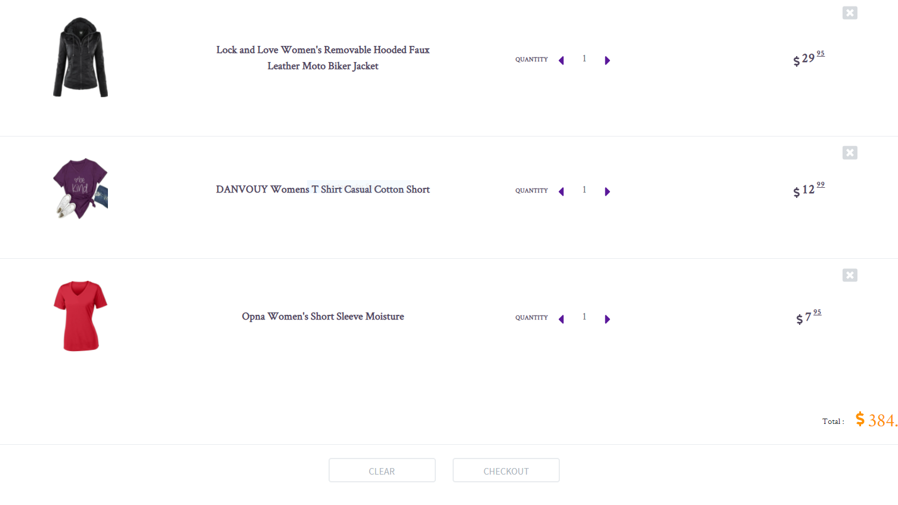

# BAM-eCommerce
A project request from *DCI* to complete at the end of *SPA-Module* after learning React!

The outcome was created from a group project and the collaborators are included in this repository.

## WHAT IS BAM-CAT? AND WHO ARE THE TEAM MEMBERS?

We are 3 students from the DCI web-development department. *"BAM"* - Is the combination of the our names first letters. And *"Cat"* - simply because we love cats. Please feel free to checkout our accounts by following the links below: 

- [Brisilda] (https://github.com/Brisilda-Bushi);
- [Anastasiia] (https://github.com/Nastasiia-Smr);
- [Mauricio] (https://github.com/mlizama11).
## WHAT HAVE WE DONE?

- Simple eCommerce Website.

## HOW LONG DID IT TAKE US?

- 4 days.

## WHAT HAVE WE USED?

- React / Redux;
- React Transition;
- React Devtools Extension;
- React DOM / React DOM Router;
- Axios;
- Bootstrap;
- Loading Skeleton;
- Web API (https://fakestoreapi.com/).

## SHORT PREVIEW

- ### __Home page hero-image__

- ### __Home page popular products__

- ### __Shop&Categories__

- ### __Product details__

- ### __Cart__
